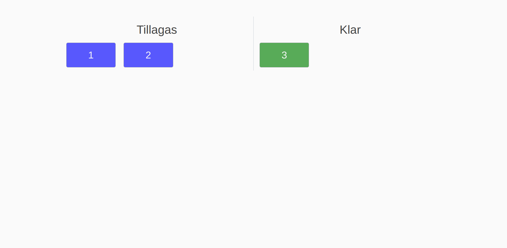
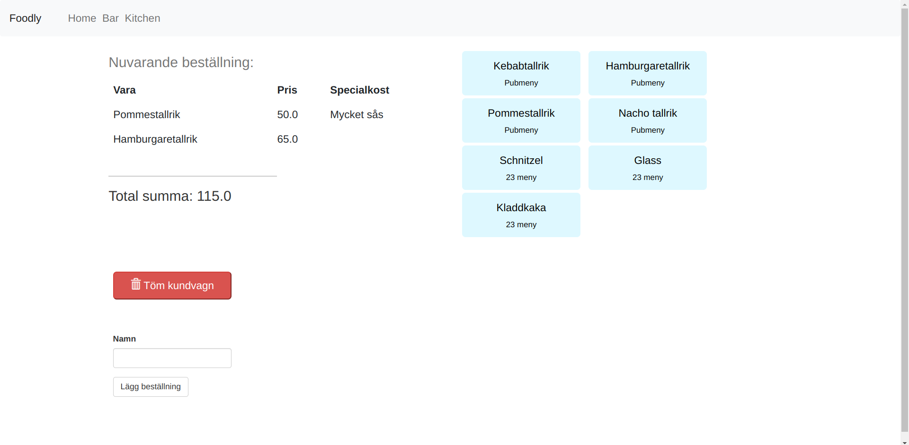
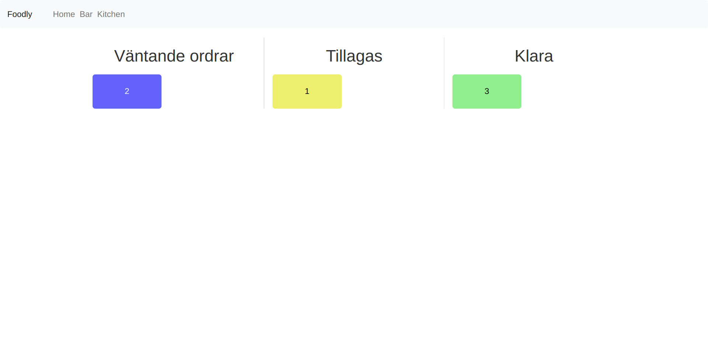

# Foodly

Foodly is a easy to use order processing system for restaurants.

This is a project for the course "Introduction to database management" (5DV202) at Umeå University, spring 2023.

A quick presentation of Foodly can be viewed in [Commercial](./foodly.py) 

## Authors

- Oscar Bohlin, c20obn@cs.umu.se
- Anton Dacklin Gaied, ens19ann@cs.umu.se

## Running Foodly

Foodly is created in Python, and the recommended Python version is 3.X.
The Python package manager `pip` is also required, consult with your operating system documentation on how to install Python and `pip`.

A Python virtual environment is recommended, but not required.

```bash
# Create and activate a virtual envoriment
python3 -m venv venv
source venv/bin/activate

# Install required pip packages
pip3 install -r requirements.txt

# Run Foodly
python3 foodly.py
```

Foodly can now be viewed in a browser: `http://127.0.0.1:5000`.

## Documentation

Foodly has three main routes:

1. `/`
2. `/bar`
3. `/kitchen`

### The main page, `/`


Here, the guests can view which orders are being processed and which are ready for pickup.



### The `/bar` page

Here the staff receive incoming orders. Items are easily added by pressing the corresponding button. By pressing an item in the cart, one can remove it or add a special diet.

There is also an option to empty the cart, if the customer changes his or hers mind entirely.

When a order is made, is is sent to the kitchen.

The `Name` field is used to backtrack which employee took the order if need be.



### The `/kitchen` page

The kitchen can see which orders are on queue, being cooked and which are ready for pickup. They can also mark, by pressing the order number, orders as being prepared and done. 



## The database

The databse consists of three tables seen below


